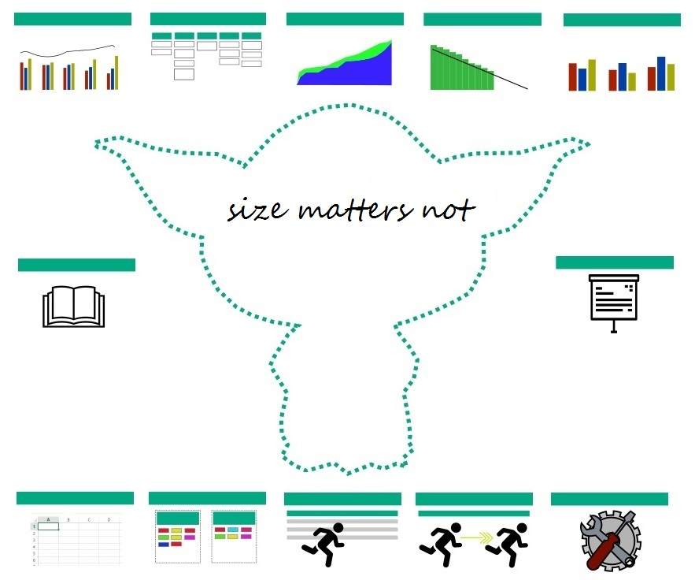

# Yoda

Yoda is a lightweight extention to GitHub (Cloud or Enterprise) for supporting Agile Project Management using GitHub issues. Yoda was developed as an internal tool inside Hewlett Packard Enterprise (HPE) and OpenSources using an MIT license in spring of 2018.

Yoda consists of a number of individual Web pages (tools) interacting via the GitHub instance via the official [GitHub API](https://developer.github.com/v3/). 

Yoda works *exclusively* of data stored in GitHub. It does not use any form of auxiliary database. Some of the Yoda tools require GitHub objects (issues, milestones and projects) to be annotated with extra data. The (very limited) extra data required is related to estimates and milestone/sprint dates.     

Yoda works best if a consistent *labelling strategy* is used for issues. Yoda includes tools for aligning labels across repositories. 

[][ss1]
[ss1]: index.html

_________

# Table of Contents

- [Yoda](#yoda)
	- [Is Yoda for you?](#is-yoda-for-you)
	- [GitHub Token](#github-token)
	- [Estimates into issues](#estimates-into-issues)
		- [Estimate alternative (labels)](#estimate-alternative-labels)
	- [Handling of milestones](#handling-of-milestones)
	- [Yoda URL Parameters](#yoda-url-parameters)
	- [Yoda Defaults](#yoda-defaults)
- [GitHub Reports](#github-reports)
	- [Issue Statistics Report](#issue-statistics-report)
	- [Burndown Report](#burndown-report)
	- [Velocity Report](#velocity-report)
	- [CFD Chart](#cfd-chart)
- [Issue Tools](#issue-tools)
	- [Kanban Board](#kanban-board)
	- [Milestone Manager](#milestone-manager)
	- [Label Manager](#label-manager)
	- [Issue Exporter](#issue-exporter)
	- [Task Copier](#task-copier)
- [Embedding Reports into another Web Page](#embedding-reports-into-another-web-page)

## Is Yoda for you?

If you use GitHub issues to simply register a few bugs, that are fixed in an ad-hoc fashion, then probably you don't need Yoda.

If, on the other hand, you are looking for an all-in-one tool to keep track of all sprint-based software development activities, including task estimation, planning and follow-up, then look no further than GitHub with Yoda!  

## GitHub Token

To access non-public repos, you need to set GitHub user-name and token. A token can be easily created by logging into GitHub, then select Settings, and Personal access tokens, Create new token. Copy your user name and the resulting token. 

To retrieve your token, select *Settings/Developer Settings/Personal access tokens* in GitHub. Be sure to select all appropriate access rights for issues management; if in doubt, give all permissions.  

The token is set centrally for your browser by using [Yoda Admin](yoda-admin.html).

*Note*: This feature uses the "localStorage" mechanism, which is not supported in earlier Internet Explorer versions.

## Estimates into issues

In support of Yoda Burndown and Velocity reporting, issues must be annotated with estimates. The estimation unit is Story Points. How Story Points are calculated is a non-tool discussion (some teams may prefer to start with man days for Story Points). Note, that some teams try to use only certain distinct values (to indicate that precision cannot be expected into the higher numbers). One example is 1,2,3,5,8,13,21,40. 

To include an estimate for an issue, put the text "> estimate (value)" **and nothing else** into a single line of the issue description (which is technically the first issue comment). Yoda will then pick up the estimate value. This notation makes the estimate appear as a MarkDown quote due to the initial bracket.

Example:
> estimate 5

Ideally, estimates should be small (less than 4-5 days). If it is difficult to break down tasks (issues) into smaller pieces, it may be necessary to use bigger estimates. To allow reporting of remaining work for such bigger issues, Yoda accepts to have remaining estimates reported. The format is "> remaining YYYY-MM-DD (number)" in the same field (description/first comment) as "> estimate". 

Example:
> estimate 22

> remaining 2017-10-04 17

> remaining 2017-10-10 6

### Estimate alternative (labels)

Some people prefer to add story points into GitHub labels instead. Yoda support this as well. In this case, create labels **with just the numeric values as the text**. Often a fibonaccci-like number set is used (e.g. 1, 2, 3 5, 8, 13, 20, 40 100). The Burndown and Velocity reports will be able to feed of these numbers. 

*Note*: When using story points into labels, no remaining function is available (e.g. open = full estimate is remaining, close = nothing is remaining).

If you use estimates into labels, it is not possible to specify a remaining estimate. In this case remaining effort will be binary; either the full estimate (issue open) or zero (issue closed).

## Handling of milestones

There are two options for representing sprints in GitHub, milestones or projects. Milestones reside at repository level and have a very tight issue integration, while projects have a more manual issue handling, but are sometimes preferred as they have the built-in Kanban board visualisation.  

A further advantage of projects is that they can reside at the organisation level (which milestones cannot). If sprint planning is done across several components stored into different repositories, this is a great advantage. Note, however, that Yoda includes a Kanban tool that allows viewing and maintenance of issues across several repositories, including the ability to sum up estimates and remaining effort across issues. 

Yoda Burndown supports both approaches. Additonal sprint data must be added either to the milestone- or project- description, depending. The additional data is the sprint start date using the a "> startdate YYYY-MM-DD" notatation. Further it is possible to specify "> burndownduedate YYYY-MM-DD" as the end date of a milestone (optional, otherwise milestone due date is used). If using projects, this is mandatory.

Finally, a capacity for the sprint (Story Points) can be set using the "> capacity (# of story points)" notation.

Example:

> startdate 2017-11-22

> capacity 51

> burndownduedate 2017-12-13

## Yoda URL Parameters

Yoda tools receive input parameters from input fields on the screen. It is also possible to enter parameters (all or some) directly in the URL of the page using the standard URL parameter passing syntax. 

Example:

> https://pages.github.hpe.com/hpsd/yoda/yoda-time-stats.html?owner=hpsd&repo=hpsd

Further the browser URL will automatically update with data in the input fields whenever the user presses a 'Draw' button. The resulting URL can then be book-marked or otherwise saved for later use. 

If all parameters are given in the URL, Yoda reports may automatically draw (not waiting for the user to press the 'Draw' button) by adding a further argument "draw=true". 

## Yoda Defaults

Yoda tools have some default values for certain fields. Some of these defaults may be overwritten using the [Yoda Admin](yoda-admin.html) tool. Note, that the defaults are maintained per-site by each browser, so it is possible to have different defaults, e.g. for github.com vs. an GitHub Enterprise instance.

## GitHub Integration

A good way of integrating Yoda reports into GitHub is use of Custom Tabs. Custom Tabs can be added to the Tab line in the GitHub Web GUI just below the organization/repository name. Often Custom Tabs will end up in a sub-menu under a "More..." tab heading.

To add a Yoda report as a custom tab, select Settings/Custom Tabs, enter tab name and Yoda URL (including the parameters you wish to define, see above), then press "Add Tab".

*Note*: Custom Tabs are only available in GitHub Enterprise, not on github.com for some reason .... 

# GitHub Reports

## Issue Statistics Report

This highly configurable report can be used to report issues statistics over time, i.e. how many open reports at a given time. All issues for the selected repositories will be retrieved (or, if repo field left blank) all issues for an entire organisation.

Issues are shown in a bar chart with the X-axis showing dates between two dates (start date and end date) at a specified interval. Defaults go back 2 months, and display until current date with a one week interval. For interval parameter, you may add an 'm' suffix to specify months rather than days. Similarly, you can specify the start date and end dates as a delta from current day (+/- days, or +/-(m) for months). 

Per default, all issues in the selected repos are considered. It is possible to specify a label filter as a comma-separate list of label values (logical AND assumed). E.g. "T1 - Defect" to show only defects, if you labeling standard denotes defects with a "T1 - Defect" label.

For a given date, you have the option of splitting issues into several bars based on a regular expression working on issues labels. The primary intention is to split based on  issue severity. It is recommended to have a good standard for these. If your labeling standard uses "S1 - Urgent", "S2 - High", "S3 - Medium", and "S4 - Low" respectively for severity labels, then putting "^S[1-4] -" will create one bar per severity value encountered. 

Instead of a regular expression, it is also possible to split issues into bars by simply specifying a comma-separate list of labels. Example: "bug, feature".

*Note*: A special value is available for Label Bar Splitting, namely "repo". This value will split the issues by their repository.

Issues without labels matching the expression/list will be put into a special "Others" bar. This may be suppressed by putting a blank value in the Others field.

A line for the total number of issues (all bars) will be drawn above the bars with a right-side axis. 

It is also possible to ask to have the bars stacked. In this case, the totals line and right axis is skipped.

Optionally, a title may be given. Otherwise a default title "GitHub Issues (owner)/(repo)" is used.

Further options display, instead of # of open issues, issues opened or closed in the period, or the average duration for issues being open.

All arguments may be supplied directly using the URL using default "parameter=<value>" notation with & between. The possible arguments are: owner, repolist, startdate, enddate, interval, labelfilter, labelsplit, other, title, user, token, count.

*Note*: The URL field repo is supported for backwards compatbility.

*Note*: Dates (startdate, enddate) may also be specified as delta ref. current date. Example: startdate=-14  (set start date to 2 weeks ago) or startdate=-10m (set start date 10 month back).

*Note*: Values for count are "noissues" and "durationopen".

*Note*: A further URL argument, draw, will result in the graph being drawn immediately (without the user having to press "Draw Chart" button). Simply add "draw=true" to URL. Similarly, it is possible to hide the header (e.g. if including the graph into a dashboard as an iFrame) by putting "hideheader=true".

The report is available [here](yoda-time-stats.html).

[Example](yoda-time-stats.html?owner=HewlettPackard&repolist=yoda-demo&draw=true)

[Example. Issues over time for Kubernetes into CoreOS](yoda-time-stats.html?owner=coreos&repolist=coreos-kubernetes&startdate=2015-08-01&interval=1m&labelsplit=&other=Issues&draw=true)

[Example. Opened issues over time for typings repo](yoda-time-stats.html?owner=typings&repolist=typings&startdate=2016-01-01&enddate=2017-02-01&interval=1m&labelsplit=bug,enhancement,question&count=opened&draw=true)

[Example. Multiple repos over time](yoda-time-stats.html?owner=typings&repolist=core,discussions,typings&startdate=2016-01-01&enddate=2017-02-01&interval=1m&labelsplit=repo&other=&draw=true)

## Burndown Report

The burndown report will show progress in remaining work over the time of a sprint (milestone or project). For milestones, the due date is taken from the milestone in GitHub, while the startdate is assumed to come from the milestone or project description field. Use the following syntax "> startdate YYYY-MM-DD". Both start end end-dates may be explicitly set as well, either in the appropriate field, or using a paramter to the URL.

*Note*: It is possible to set another duedate for the burndown chart (e.g. if you are just estimating development tasks, and not estimating the final testphase before delivery of the milestone). Use "> burndownduedate YYYY-MM-DD" into the milestone description field in that case. For project, you *must* use this feature to set the due date (as no other due date is present for the project).

The burndown chart will display total work remaining for a given day during the milestone - taking into consideration the issue state (closed = no work remaining), (open = estimate or relevant remaining value).

An "ideal" line will be drawn between (total of estimates) on the first date, and 0 (all work done). on the last date. If the planner wants to work with a higher capacity, this may be specified in the milestone/project using "> capacity (number)" syntax, overridden in the corresponding field, or set by URL argument.

As part of sprint planning, often tentative/stretch goals are used. Normally, in GitHub, this will be indicated by a special label. For SD, "P - Tentative" is used, so this is the default value. Issues with this label are added to a special yellow tentative bar above the committed green bar.

*Note*: The burndown report works from Story Points as given by "> estimate" tags into the issues. However, it is possible to build a burn down, considering simply the number of open issues. To do this, uncheck the "Estimate in Issues" checkbox.

The burndown page also includes an option for displaying a table of all issues associated with a milestone, along with their estimates and remaning work. Just press "Show table". You may click on "Issue Id" in the table header to export the table to a CSV file, e.g. for importing to Excel. The open state will be shown in **bold** if a special "in progress label" is present. 

URL arguments accepted are: owner, repo, estimate (noissues, inbody, or inlabels), user, token, tentative, inprogress, milestone, project.

*Note*: startdate, duedate, capacity are taken from milestone/projects respectively.

*Note*: A further URL argument, draw, will result in the graph/table being rendered immediately (without the user having to press "Draw Chart" or "Show table" button). Simply add "draw=chart" or "draw=table" to URL. Similarly, it is possible to hide the header (e.g. if including the graph into a dashboard as an iFrame) by putting "hideheader=true".

The report is available [here](yoda-burndown.html).

[Example](yoda-burndown.html?owner=HewlettPackard&repo=yoda-demo&estimate=inbody&milestone=Sprint 2&draw=chart).

## Velocity Report

Velocity report reports number of story points done per milestone/sprint for a given repo. You may select which milestones to report on using a multi-select field. 

Furthermore, the tool attempts to report the estimate/story points per day. If the milestone has no startdate set (using "> startdate" tag explained above), this is not drawn. 

Like the burndown report, the number of issues can be used instead of estimates/story points. Just select the appropriate radio button.

The report is available [here](yoda-velocity.html).

[Example](yoda-velocity.html?owner=HewlettPackard&repo=yoda-demo).

## CFD Chart

Yoda allows to build a Cummulative Flow Diagram (CFD) by analyzing GitHub open and closed states for issues. Often CFDs will display issues into several substates (so not just open and closed), but as substates are not native to GitHub, this is not considered for now. 

The report also allows drawing a Lead Time graphs (the average time taken to address an isssue). 

If you do not specify a start date, Yoda will set the start date at the time the first repo issue was created. 

For more details on specifying interval, start date and end date, consult the Issues Statistics Report.

As wit the Issue Statistics Report, multiple repositories may be specified. 

The report is available [here](yoda-cfd.html).

[Example](yoda-cfd.html?owner=HewlettPackard&repolist=yoda-demo&interval=3&draw=cfd).  

# Issue Tools

## Kanban Board

Yoda includes a label-driven Kanban board. Note, that this is different than GitHub based projects, which also deliver a Kanban view. The advantage of Yoda Kanban boards is that it allows different views (i.e. column definitions) of issues across repositories within the same organization.

Columns are defined based on labels, which of course should be mutually exclusive to make sense. The column defnitions is a comma separate list of [<column title>]<issue state>:<label text>. Issue state can be open, closed, or all. The label text may be set to "*" for match all labels.

A number of column definitions are included. Assuming you use "T1 - Defect", "T2 - Enhancement", "T3 - Task" for issue types, the following defintion defines a nice Kanban board. 

[Defect]open:T1 - Defect,[Enhancement]open:T2 - Enhancement,[Task]open:T3 - Task,[Other]open:*,[Closed]closed:*

Note the "Other" coloumn, which will catch any issue not annotated as either a Defect, Enhancement or Task.

You may switch between different column views by simply selecting a different label definition from the pull down menu.

If unlocked (uncheck the box), the viewer may also be used to modify column-defined labels by dragging cards (issues) from one column to another. If you drag to a column defined as holding issues in a different state (open vs. closed), the issue will be closed (or re-opened).

The Kanban Board is available [here](yoda-kanban.html).

[Example](yoda-kanban.html?owner=HewlettPackard&repolist=yoda-demo&milestonelist=Sprint%201,Sprint%202&columns=[Defect]open:T1%20-%20Defect,[Enhancement]open:T2%20-%20Enhancement,[Task]open:T3%20-%20Task,[Other]open:*,[Closed]closed:*).

[Example - typings repo](yoda-kanban.html?owner=typings&repolist=typings&estimate=noissues&milestonelist=All%20milestones&columns=[Bug]open:bug,[Enhancement]open:enhancement,[Question]open:question,[Other]open:*,[Closed]closed:*)

## Milestone Manager

In order to support sprint planning and tracking across issues into separate repositories, it is necessary to ensure consistency between the milestones in those repositories. Also, it is helpful to have a tool to create these milestones for you with a single input. The Milestone Manager does just this.

It is a very simple tool. You select the repositories that will be involved in the sprint. Then you may fill in common data (description, start date, due date, and optionally a burndown due date). Press "Create Milestones" and the Milestone Manager will create an instance of the milestone into each repository.

Similarly, you can change those common fields easily across all the repos. First make the change into the milestone for one of the repos, then press "Copy/Update" to replicate to the milestones in the other repos. If the milestone does not exist in one of the selected repositories, it will be created.

The Milestone Manager is available [here](yoda-milestone-manager.html).

## Label Manager

Yoda also includes a Label manager which can be used to copy labels from one repository to another. This greatly helps in have standard labels across repositories in a programme. The label manager is self-explanatory, and works by simply clicking labels to copy them. It is also possible to copy all labels across with one click.

Label manager can also delete labels, but only in case no issues (open or closed) are associated to them. This prevents accidental deletion of in-use labels.

Label manager is available [here](yoda-label-manager.html).

[Example](yoda-kanban.html?srcowner=hewlettpackard&srcrepo=yoda-demo&dstowner=hewlettpackard&dstrepo=yoda-demo2).

## Issue Exporter

Yoda includes a powerful issues exporter, which can output issues to CSV files, suitable e.g. for importing into Excel. A large number of configuration options exists. 

The exporter can export issues multiple repositories within the same organization or - if repo field is left blank - then all organization repos will be scoped for export.

In the end, the columns of the resulting CSV file is defined in the "Fields" input box as a comma-separated list. The default list of fields are: Owner,Repo,Number,Issue Type,Severity,State,Submitter,Assignee,Milestone,Created at,Closed at,Duration,Title,Estimate,Remaining.

Of these, "Issue Type", "Severity", "Estimate", and "Remaining" are special fields. 

"Issue Type" and "Severity" are defined in the "Multi-label column definitions" box. Such definitions allow multiple labels (that should be mutually exclusive on each issue) to be merged into a single column. E.g. the defaults assume that issues are defined by a label prefixed by "T<1-9> - ".

Besides the fields mentioned in the "Fields" list, extra fields are added to the CSV file based on sources: "Single label column definitions" and "Single label column regexps".

Columns mentioned in "Single label column definitions" are added based on the label mentioned. If a given issue has the label assigned, the cell will be filled with the "Label indicator", otherwise it will be blank. The default for the "Label indicator" is "1", thus allowing the number of issues with this label set to be easily counted, e.g. in a PivotTable.

Correspondingly, "Single label column regexps" add columns with label indicators to the CSV file. In this case, however, the colums are not explicitly named, only their pattern. For example, assuming that the labelling convention calls for prefixing customer encountered issues with "C - <customer name>", then the prefix "^C -" will cause all customer labels to received their own column, like "C - Acme Corp".

Finally, it is possible to detail if only open issues, only closed issues, or simply all issues should be exported. Further, the file name, CSV separator, and "Label indicator" may be specified as options.

Issues exporter is available [here](yoda-exporter.html).

[Example](yoda-exporter.html?owner=HewlettPackard&repolist=yoda-demo&outputfile=yoda.csv&estimate=inbody&state=all&export=true).

## Task Copier

Yoda has a highly specialized small tool aimed at replicating recurring issues between milestones. You may have issues with tasks related to things that are recurring in each milestone, e.g. "Review documentation", "Build the package", "Upload to FTP server". In order to do this, a number of things are required. First of all the issue title must start with the milestone in brackets, e.g. "[MS 2.1] Build the package". Secondly, the issues may be filtered, typically based on labels, e.g. "Q - Recurring".

When starting a new milestone, e.g. MS 2.2, you are able to have the Task Copier replicate the tasks for you. A new issue, e.g. "[MS 2.2] Build the package" will be created into the MS 2.2 milestone. 

The tool will also copy the issue body across. It will do a few modifications to the body. First, it will remove any "> remaining ..." lines (as the issue in the new milestone needs to be done again). Then, it will remove any checkmarks into taskslists that may be present in the body (e.g. - [x] Extract source code from git" => - [ ] Extract the source code from git.).

The Task Copier is available [here](yoda-copy-tasks.html).

# Embedding Reports into another Web Page

It is possible to embed Yoda reports into other Web Pages, typically using the HTML *iframe* feature. Often this will be used along with the "hideheader=true" parameter. The remaining part of the URL (the src= part) can be simply copied from the Web browser URL line when you have constructed the report as you like.

Example:

`<iframe width="1200px" height="600px" style="border:0" src="https://pages.github.com/HewlettPackard/yoda/yoda-time-stats.html?owner=HewlettPackard&amp;repo=yoda-demo&amp;draw=true&amp;hideheader=true"></iframe>`

