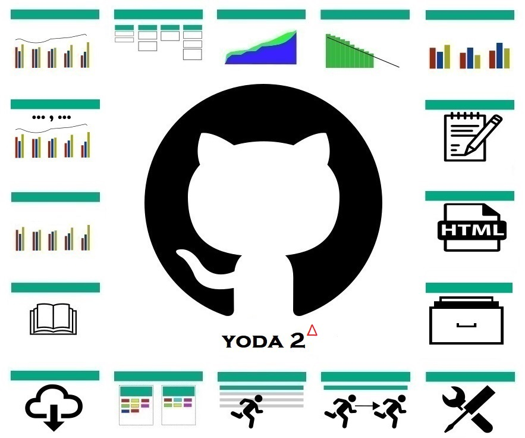

# Yoda

Yoda is a lightweight extention to GitHub (Cloud or Enterprise) for supporting Agile Project Management using GitHub issues. Yoda was developed as an internal tool inside Hewlett Packard Enterprise (HPE) and OpenSources using an MIT license in spring of 2018.

Yoda consists of a number of individual Web pages (tools) interacting via the GitHub instance via the official [GitHub API](https://developer.github.com/v3/). 

Yoda works *exclusively* of data stored in GitHub. It does not use any form of auxiliary database. Some of the Yoda tools require GitHub objects (issues and milestones) to be annotated with extra data. The (very limited) extra data required is related to estimates and milestone/sprint dates.     

Yoda works best if a consistent *labeling strategy* is used for issues. Yoda includes tools for aligning labels across repositories. 

[][ss1]	[][ss1]
[ss1]: index.html
_________

# Table of Contents

- [Yoda](#yoda)
- [Table of Contents](#table-of-contents)
	- [Is Yoda for you?](#is-yoda-for-you)
	- [GitHub Token](#github-token)
	- [Estimates into issues](#estimates-into-issues)
		- [Estimate alternative (labels)](#estimate-alternative-labels)
	- [Handling of milestones](#handling-of-milestones)
	- [Yoda URL Parameters](#yoda-url-parameters)
	- [Yoda Defaults](#yoda-defaults)
	- [GitHub Integration](#github-integration)
- [GitHub Reports](#github-reports)
	- [Issue Statistics Report](#issue-statistics-report)
	- [Issue Statistics Report - Current View](#issue-statistics-report---current-view)
		- [Use for time based velocity charts](#use-for-time-based-velocity-charts)
	- [Burndown Report](#burndown-report)
	- [Velocity Report](#velocity-report)
	- [CFD Chart](#cfd-chart)
	- [Release Notes](#release-notes)
	- [Repositories](#repositories)
- [Issue Tools](#issue-tools)
	- [Kanban Board](#kanban-board)
	- [Milestone Manager](#milestone-manager)
	- [Label Manager](#label-manager)
	- [Issue Exporter](#issue-exporter)
	- [Issue Web Exporter](#issue-web-exporter)
	- [Task Copier](#task-copier)
- [Embedding Reports into another Web Page](#embedding-reports-into-another-web-page)
- [Selecting repos based on topics or name wildcarding](#selecting-repos-based-on-topics-or-name-wildcarding)
- [CSV Statistics Report](#csv-statistics-report)

## Is Yoda for you?

If you use GitHub issues to simply register a few bugs, that are fixed in an ad-hoc fashion, then probably you don't need Yoda.

If, on the other hand, you are looking for an all-in-one tool to keep track of all sprint-based software development activities, including task estimation, planning and follow-up, then look no further than GitHub with Yoda!  

## GitHub Token

To access non-public repos, you need to set GitHub user-name and token. To retrieve your token, select *Settings/Developer Settings/Personal access tokens* in GitHub. Be sure to select all appropriate access rights for issues management; if in doubt, give all permissions.  

The token is set centrally for Yoda in your browser by using [Yoda Admin](yoda-admin.html).

*Note*: This feature uses the "localStorage" mechanism, which is not supported in earlier Internet Explorer versions.

## Estimates into issues

In support of Yoda Burndown and Velocity reporting, issues must be annotated with estimates. The estimation unit is Story Points. How Story Points are calculated is a non-tool discussion (some teams prefer to start with man days for Story Points). Note, that some teams try to use only certain distinct values (to indicate that precision cannot be expected into higher estimates). One example is Fibonacci-like sequence 1,2,3,5,8,13,21,40. 

To include an estimate for an issue, put the text "> estimate (value)" **and nothing else** into a single line of the issue body (which is technically the first issue comment). Yoda will then pick up the estimate value. This notation makes the estimate appear as a MarkDown quote due to the initial bracket.

Example:
> estimate 5

Ideally, estimates should be small (less than 4-5 days). If it is difficult to break down tasks (issues) into smaller pieces, it may be necessary to use higher estimates. To allow reporting of remaining work for such issues, Yoda accepts to have remaining estimates reported. The format is "> remaining YYYY-MM-DD (number)" in the same field (description/first comment) as "> estimate". 

Example:
> estimate 22

> remaining 2017-10-04 17

> remaining 2017-10-10 6

### Estimate alternative (labels)

Some people prefer to add story points into GitHub labels instead. Yoda support this as well. In this case, create labels **with just the numeric values as the text**. Again, often a Fibonaccci-like number set is used (e.g. 1, 2, 3 5, 8, 13, 20, 40 100). The Burndown and Velocity reports will be able to feed of these numbers. 

If you use estimates into labels, it is not possible to specify a remaining estimate. In this case remaining effort will be binary; either the full estimate (issue open) or zero (issue closed).

## Handling of milestones

There are two options for representing sprints in GitHub, milestones or projects. Milestones reside at repository level and have a very tight issue integration, while projects have a more manual issue handling, but are sometimes preferred because of their Kanban board visualization.  

A further advantage of projects is that they can reside at the organisation level (which milestones cannot). If sprint planning is done across several components stored into different repositories, this is a great advantage. 

Yoda tools are able to work across repositories, so Yoda uses milestones (with identical names across repositories) to define sprints. 

For example, Yoda add it's own Kanban tool that allows viewing and maintenance of issues across several repositories, including the ability to sum up estimates and remaining effort across all issues.  

Also, Yoda Burndown and Velocity Reports support planning across repositories based on sprint milestones. 

A milestone manager helps to keeping repository milestones in sync. Additional sprint data must be added to the milestone description. The additional data is the sprint start date using the a "> startdate YYYY-MM-DD" notation. 

Further it is possible to specify "> burndownduedate YYYY-MM-DD" as sprint date where all estimated activities (typically development) should have been finished. This is of course optional, otherwise milestone due date is used. 

Also, a capacity for the sprint (Story Points) can be set using the "> capacity (# of story points)" notation.

Finally, an additional piece of data (maybe a version number or alternative name that the component(s) in the repository delivers) may be set using a "> info *text*" format. The milestone managers allows this to be set easily.

Example:

> startdate 2017-11-22

> capacity 51

> burndownduedate 2017-12-13

## Yoda URL Parameters

Yoda tools receive input parameters from input fields on the screen. It is also possible to enter parameters (all or some) directly in the URL of the page using the standard URL parameter passing syntax. 

Example:

> https://pages.github.hpe.com/hpsd/yoda/yoda-time-stats.html?owner=hpsd&repo=hpsd

Further the browser URL will automatically update with data in the input fields whenever the user presses a 'Draw' button. The resulting URL can then be book-marked or otherwise saved for later use. 

If all parameters are given in the URL, Yoda reports may automatically draw (not waiting for the user to press the 'Draw' button) by adding a further argument "draw=true". 

## Yoda Defaults

Yoda tools have some default values for certain fields. Some of these defaults may be overwritten using the [Yoda Admin](yoda-admin.html) tool. Note, that the defaults are maintained per-site by each browser, so it is possible to have different defaults, e.g. for github.com vs. an GitHub Enterprise instance.

## GitHub Integration

A good way of integrating Yoda reports into GitHub is use of Custom Tabs. Custom Tabs can be added to the Tab line in the GitHub Web GUI just below the organization/repository name. Often Custom Tabs will end up in a sub-menu under a "More..." tab heading.

To add a Yoda report as a custom tab, select Settings/Custom Tabs, enter tab name and Yoda URL (including the parameters you wish to define, see above), then press "Add Tab".

*Note*: Custom Tabs are only available in GitHub Enterprise, not on github.com for some reason .... 

# GitHub Reports

Note: Data from Yoda graphic reports may be be exported by clicking (left-click) on the graph while holding down the Alt key. This will generate and download a CSV file (fixed filename `yoda-data.csv`) which can then be imported to e.g. Excel. Note that this is just the graph data, not the set-up of the graph (title, series formatting, etc.). The idea is to allow customized Excel graphics if required. In order to download the graphics you can either use copy-paste or hold down the Crtl key while clicking on the graph. In this case a PNG file with the image will be downloaded.

## Issue Statistics Report

This highly configurable report can be used to report issues statistics over time, i.e. how many open reports at a given time. All issues for the selected repositories will be retrieved (or, if repo field left blank) all issues for an entire organisation.

Issues are shown in a bar chart with the X-axis showing dates between two dates (start date and end date) at a specified interval. Defaults go back 2 months, and display until current date with a one week interval. For interval parameter, you may add an 'm' suffix to specify months rather than days. Similarly, you can specify the start date and end dates as a delta from current day (+/- days, or +/-(m) for months). 

Per default, all issues in the selected repos are considered. It is possible to specify a label filter as a comma-separate list of label values (logical AND assumed). E.g. "T1 - Defect" to show only defects, if you labeling standard denotes defects with a "T1 - Defect" label. If you prefix label(s) in the list with a minus (-), issues marked with such label(s) are excluded.

As a special filtering feature, you may filter also using regular expressions. If you specify in the comma-separated list a value starting `^` (or `-^` for negative match), the subsequent regular expression will be used as filter.  

Yet another filtering feature is not really filtering. It allows as part of the filter to add a synthesized label to an issue. If matching (or not) based on the regular expression then the label text put after a `~` will be added to the issue. This can then later be used e.g. for bar splitting. Example: `^C -~Customer Encountered`.

Finally you can filter on special fields into the issue body (first comment); while this is strictly not a label filter. You can filter for presence - or - lack of a given field. This is done by starting the filter by `>`. Example: `>-estimate` to filter issues which *do not have* an `> estimate` entry.

For a given date, you have the option of splitting issues into several bars based on a regular expression working on issues labels. The primary intention is to split based on  issue severity. It is recommended to have a good standard for these. If your labeling standard uses "S1 - Urgent", "S2 - High", "S3 - Medium", and "S4 - Low" respectively for severity labels, then putting "^S[1-4] -" will create one bar per severity value encountered. 

Instead of a regular expression, it is also possible to split issues into bars by simply specifying a comma-separate list of labels. Example: "bug, feature". 

*Note*: A special value is available for Label Bar Splitting, namely "repo". This value will split the issues by their repository.

*Note*: It is possible to control the legend displayed for the bar the a given label. If you want to do this, put the desired label as the first positional expression in the regular expression. Example: "^S[1-4] - (.*)$" will make legends "Urgent", "High", "Medium", "Low" skipping the S bit..

Issues without labels matching the expression/list will be put into a special "Others" bar. This may be suppressed by putting a blank value in the Others field.

A line for the total number of issues (all bars) will be drawn above the bars with a right-side axis. 

It is also possible to ask to have the bars stacked. In this case, the totals line and right axis is skipped.

Optionally, a title may be given. Otherwise a default title "GitHub Issues (owner)/(repo)" is used.

Further options display, instead of # of open issues, issues opened or closed in the period, or the average duration for issues being open. When using these options a further checkbox, termed *Right total* comes into play. If checked, the right axis will show the number of open issues, as opposed to the default/unchecked mode where the right axis shows the total opened/closed during the period.

Finally, it is possible to product a so-called "floating bar chart" showing both closed issues (as a negative number below the Y-axis) and opened issues (as a positive number above the Y-axis).

It is even possible to report relative percentages (so all statistics add up to 100%) instead of reporting on number of issues. This can be controlled with `percentage` URL argument or by checking the corresponding checkbox.

Yet a further option focuses on issues comments rather than issues. This can be used to give a further indication of the level of activity. Select "comments" to count instead of issues.

All arguments may be supplied directly using the URL using default "parameter=<value>" notation with & between. The possible arguments are: owner, repolist, startdate, enddate, interval, labelfilter, labelsplit, other, title, user, token, count.

The tool may also show the so-called ECT (Engineering Cycle Time). This is defined as the number of days between when work started on the issue and when it was close. The start date is aligned to the start of the milestone to which the issue is assigned or the start date of the issue - whichever is the latest.

*Note*: The URL field repo is supported for backwards compatbility.

*Note*: Dates (startdate, enddate) may also be specified as delta ref. current date. Example: startdate=-14  (set start date to 2 weeks ago) or startdate=-10m (set start date 10 month back).

*Note*: Values for count are "noissues" and "durationopen".

*Note*: A further URL argument, draw, will result in the graph being drawn immediately (without the user having to press "Draw Chart" button). Simply add "draw=true" to URL. Similarly, it is possible to hide the header (e.g. if including the graph into a dashboard as an iFrame) by putting "hideheader=true".

*Note*: Across all reports, it is possible to hide the top panel (set of fields). This is done from the Yoda menu (the "Hamburger"). You may also request this by setting the URL argument `hidepanel=true`.

## Issue Statistics Report - Current View

A variant of the issues statistics report that focuses strictly on issues in their current state is also available. The default is to consider only open issues, but even closed or all issues may be scoped with an option. This case considers naturally only the current situation. Consequently, all parameters related to dates (start date, end date, interval, etc.) is of course not valid and thus not present. Instead the issues may be grouped along the X-axis into different categories. The splitting into categories works in exactly the same way as when splitting issues into different bars. 

In effect, this allows issues to be split according to two dimensions; a category along the X-axis and the actual bars (stacked or non-stacked) along the Y-axis.

### Use for time based velocity charts

As a further option, it is possible to set-up the tool to work out velocity based on estimates (in the body of the issue or in labels). The velocity is calculated as the total story points estimates for all issues *closed* during the interval (note that this is the interval leading *up to* the date shown). Right right side axis will change in this case to display the average story points per day.

The report is available [here](yoda-time-stats.html).

[Example](yoda-time-stats.html?owner=HewlettPackard&repolist=yoda-demo&draw=true)

[Example. Issues over time for coreos-installer in CoreOS](yoda-time-stats.html?owner=coreos&repolist=coreos-installer&startdate=2019-05-01&interval=1m&labelsplit=&other=Issues&draw=true)

[Example. Opened issues over time for typings/api repo](yoda-time-stats.html?owner=typings&repolist=api&startdate=2016-01-01&enddate=2017-02-01&interval=1m&labelsplit=bug,enhancement,question&count=opened&draw=true)

[Example. Closed issues over home-assistant/operating-system - with right axis showing total # issues](yoda-time-stats.html?owner=home-assistant&repolist=operating-system&startdate=2021-12-20&interval=1m&labelfilter=bug&labelsplit=^board&title=Home%20Assistant%20IO%20Closed%20Bugby%20board&stacked=true&count=closed&draw=true)

[Example. Multiple repos over time](yoda-time-stats.html?owner=typings&repolist=registry,discussions,typings&startdate=2016-01-01&enddate=2017-02-01&interval=1m&labelsplit=repo&other=&draw=true)

## Burndown Report

The burndown report will show progress in remaining work over the time of a sprint. Work in a sprint is defined by all issues belonging to that milestone (as defined by the milestone name) into one or multiple repositories. 

The due date is taken from the milestone in GitHub, while the startdate is assumed to come from the milestone description field. Use the following syntax "> startdate YYYY-MM-DD". Both start end end-dates may be explicitly set as well, either in the appropriate field, or using a paramter to the URL.

*Note*: It is possible to set another duedate for the burndown chart (e.g. if you are just estimating development tasks, and not estimating the final testphase before delivery of the milestone). Use "> burndownduedate YYYY-MM-DD" into the milestone description field in that case.

The burndown chart will display total work remaining for a given day during the milestone - taking into consideration the issue state (closed = no work remaining), (open = estimate or relevant remaining value).

An "ideal" line will be drawn between (total of estimates) on the first date, and 0 (all work done). on the last date. If the planner wants to work with a higher capacity, this may be specified in the milestone/project using "> capacity (number)" syntax, overridden in the corresponding field, or set by URL argument. When drawing burndown across several repositories, all present capacity values are added to form the starting point for the ideal line.

A further "ideal" line will be drawn for issues that must be completed before a supplied burndown date. Even further, a trendline may be drawn using linear regression; simply select the "TrendLine" box.

As part of sprint planning, often tentative/stretch goals are used. Normally, in GitHub, this will be indicated by a special label. Default is "P - Tentative". Issues with this label are added to a special yellow tentative bar above the committed green bar.

*Note*: The burndown report works from Story Points as given by "> estimate" tags into the issues. However, it is possible to build a burn down, considering simply the number of open issues. To do this, uncheck the "Estimate in Issues" checkbox.

The burndown page also includes an option for displaying a table of all issues associated with a milestone, along with their estimates and remaning work. Just press "Show table". You may click on "Issue Id" in the table header to export the table to a CSV file, e.g. for importing to Excel. The open state will be shown in **bold** if a special "in progress label" is present. A special "Additional Data" column may be customized. The default value is to include an issue severity based on a label convention where severity conform to an "S[1-4] - <severity text>" format.

It is possible to filter for events assigned to a given GitHub login. If more than one person is assigned to a task, the estimates are divided evenly.

URL arguments accepted are: owner, repo, estimate (noissues, inbody, or inlabels), user, token, tentative, inprogress, notcodefreeze, milestone, additionaldata, trendline, assignee, capacity.

*Note*: If the capacity argument is supplied, any capacity values from the milestone(s) are ignored.

*Note*: startdate, duedate, capacity are taken from milestone/projects respectively.

*Note*: A further URL argument, draw, will result in the graph/table being rendered immediately (without the user having to press "Draw Chart" or "Show table" button). Simply add "draw=chart" or "draw=table" to URL. Similarly, it is possible to hide the header (e.g. if including the graph into a dashboard as an iFrame) by putting "hideheader=true".

*Note*: If you specific in the URL argument the milestone as "_CURRENT_", then Yoda will attempt to select - based on start and duedate - the current sprint. If multiple milestones would match, it is possibly to continue the "_CURRENT_" string with additional characters which must match the milestone title in order to select the milestone. Example: "_CURRENT_PORTAL".

The report is available [here](yoda-burndown.html).

[Example](yoda-burndown.html?owner=HewlettPackard&repo=yoda-demo&estimate=inbody&milestone=Sprint 2&draw=chart).

## Velocity Report

Velocity report reports number of story points done per milestone/sprint for a given repo. You may select which milestones to report on using a multi-select field. 

Furthermore, the tool attempts to report the estimate/story points per day. If the milestone has no startdate set (using "> startdate" tag explained above), this is not drawn. 

Like the burndown report, the number of issues can be used instead of estimates/story points. Just select the appropriate radio button.

It is furthermore possible to split the total estimate/story points by different labels, typically by the type or severity of the issue. Put a comma-separated list of labels intot he "Split Labels" field. Remaining issues will be put into a final bar, the legend of which is controlled by the "Split Other" fields. Per default, no splitting is done and all issues are put with the legend given by "Split Other" (Default "Story points"). 

In the case of label splitting, it is also possible to tick a checkbox (Show Bar Percentages) in order to show the relative contribution from each type.

The report is available [here](yoda-velocity.html).

[Example](yoda-velocity.html?owner=HewlettPackard&repo=yoda-demo).

## CFD Chart

Yoda allows to build a Cummulative Flow Diagram (CFD) by analyzing GitHub open and closed states for issues. Often CFDs will display issues into several substates (so not just open and closed), but as substates are not native to GitHub, this is not considered for now. 

The report also allows drawing a Lead Time graphs (the average time taken to address an isssue). 

If you do not specify a start date, Yoda will set the start date at the time the first repo issue was created. 

For more details on specifying interval, start date and end date, consult the Issues Statistics Report.

As wit the Issue Statistics Report, multiple repositories may be specified. It is also possible to specify label and/or milestone filtering.  

The report is available [here](yoda-cfd.html).

[Example](yoda-cfd.html?owner=HewlettPackard&repolist=yoda-demo&interval=3&draw=cfd).  

## Release Notes

Yoda has a special reporting tool, that enables the automatic generation of Release Notes. Release Notes are generated based on issues across one of multiple repositories and milestones. The report is highly configurable. The default configuraton shows New Features and Solved Issues based on "T2 - Enhancement" and "T1 - Defect" labels, but this can be changed easily.

For each issue, the issue number and issue title are reported. Further, a more detailed explanation of the issue can be added to the GitHub issue. This is done by adding a section in the issue description (the first comment) that starts with "> RN". All lines below, until the next blank line, is included as extra details for that issue. It is possible to use markdown notation into the > RN field. 

The title of the issue used in the release note may be optionally overwritten using another special "> RNT" notation. In this case, the next line is taken instead as the issue title.

Sometimes it is necessary to generate a patch which includes issues already delivered as part of another milestone. In this case, it is possible to create a special *MetaIssue* (default label `T9 - MetaIssue`) referring to such issues. This is achieved by putting `> META (list of issue references)`, e.g. `> META #2342 #123 #12`. In this case, those 3 issues will be picked up in the same way as if they would have been associated with the milestone and included in the Release Notes.

A special "Known Issues" Release note list can also be generated (similar to the normal Release Note). What is special here is the selection of issues. Here issues are taken from all repository Milestone *if* they have a Known Issues Label set, default "Q - Known Issue".

URL arguments accepted are: owner, repo, milestones, outputformat, tablelayout, rnlabeltypes, rnskiplabel, rnmetalabel, rnknownlabel, labelfilter.

The report is available [here](yoda-release-notes.html).

[Example](yoda-release-notes.html?owner=HewlettPackard&repolist=yoda-demo).  

## Repositories

Yoda has a tool to generate a table of repositories and their attributes. This can provide a good overview of repositories. It is possible to scope as well by name JSON files (in default branch or even per-branch) containing additional information related to the repository.

Table columns can be defined by given a comma-separate list of "Column Header:tag". Possible tags are:

- `%r`: The name of the repository
- `%b`: The name of the branch
- `%d`: The repository description
- `%u`: The repository URL
- `%t`: The list of topics for the repository separated by commas.
- `%o-(topic)`: A true/false column for a given topic. If the topic is present, put `Yes` in the table cell, otherwise blank. Example: `%o-public`
- `%j-(attribute)`: Assume JSON file as supplied is present in the branch (default or specific), search this file in order to find the attribute value. If not found, show blank. Attribute can be multi-level. Example: `%j-basicinfo.vendor`
- `%i-(attribute)`: Access repository values returned from the GitHub API directly to return the value of attribute given. If note found, show blank. Can be multi-level.

The report is available [here](yoda-repositories.html).

# Issue Tools

## Kanban Board

Yoda includes a label-driven Kanban board. Note, that this is different than GitHub based projects, which also deliver a Kanban view. The advantage of Yoda Kanban boards is that it allows different views (i.e. column definitions) of issues across repositories within the same organization.

Columns are defined based on labels, which of course should be mutually exclusive to make sense. The column definitions is a comma separate list of [<column title>]<issue state>:<label text>. Issue state can be open, closed, or all. The label text may be set to "*" for match all labels.

A number of column definitions are included. Assuming you use "T1 - Defect", "T2 - Enhancement", "T3 - Task" for issue types, the following defintion defines a nice Kanban board. 

[Defect]open:T1 - Defect,[Enhancement]open:T2 - Enhancement,[Task]open:T3 - Task,[Other]open:*,[Closed]closed:*

Note the "Other" coloumn, which will catch any issue not annotated as either a Defect, Enhancement or Task.

You may switch between different column views by simply selecting a different label definition from the pull down menu.

If unlocked (uncheck the box), the viewer may also be used to modify column-defined labels by dragging cards (issues) from one column to another. If you drag to a column defined as holding issues in a different state (open vs. closed), the issue will be closed (or re-opened).

The Kanban Board is available [here](yoda-kanban.html).

[Example](yoda-kanban.html?owner=HewlettPackard&repolist=yoda-demo&milestonelist=Sprint%201,Sprint%202&columns=[Defect]open:T1%20-%20Defect,[Enhancement]open:T2%20-%20Enhancement,[Task]open:T3%20-%20Task,[Other]open:*,[Closed]closed:*).

[Example - typings/registry repo](yoda-kanban.html?owner=typings&repolist=registry&estimate=noissues&milestonelist=All%20milestones&columns=[Bug]open:bug,[Enhancement]open:enhancement,[Question]open:question,[Other]open:*,[Closed]closed:*)

## Milestone Manager

In order to support sprint planning and tracking across issues into separate repositories, it is necessary to ensure consistency between the milestones in those repositories. Also, it is helpful to have a tool to create these milestones for you with a single input. The Milestone Manager does just this.

It is a very simple tool. You select the repositories that will be involved in the sprint. Then you may fill in common data (description, start date, due date, and optionally a burndown due date). Press "Create Milestones" and the Milestone Manager will create an instance of the milestone into each repository.

Similarly, you can change those common fields easily across all the repos. First make the change into the milestone for one of the repos, then press "Copy/Update" to replicate to the milestones in the other repos. If the milestone does not exist in one of the selected repositories, it will be created.

Milestone manager allows you to maintain a capacity value (used in the Burndown and Velocity graph tools) as well as an ED (Engineering Days) values used exclusively in the Velocity Graph tool. If subteams are working in the same repo, it is possible to specifify capacities per team by clicking the magnifying glass and entering a set of lines as *<capacity>,<team label>*. Same for ED. 

The Milestone Manager is available [here](yoda-milestone-manager.html).

## Label Manager

Yoda also includes a Label manager which can be used to copy labels from one repository to another. This greatly helps in have standard labels across repositories in a programme. The label manager is self-explanatory, and works by simply clicking labels to copy them. It is also possible to copy all labels across with one click.

Label manager can also delete labels, but only in case no issues (open or closed) are associated to them. This prevents accidental deletion of in-use labels.

Label manager is available [here](yoda-label-manager.html).

[Example](yoda-label-manager.html?srcowner=hewlettpackard&srcrepo=yoda-demo&dstowner=hewlettpackard&dstrepo=yoda-demo2).

## Issue Exporter

Yoda includes a powerful issues exporter, which can output issues to CSV files, suitable e.g. for importing into Excel. A large number of configuration options exists. 

The exporter can export issues multiple repositories within the same organization or - if repo field is left blank - then all organization repos will be scoped for export.

In the end, the columns of the resulting CSV file is defined in the "Fields" input box as a comma-separated list. The default list of fields are: Owner,Repo,Number,Issue Type,Severity,State,Submitter,Assignee,Milestone,MilestoneDate,Created at,Closed at,Duration,DurationMilestone,Title,Estimate,Remaining,Url.

Further defaulted are a set of "Epic xx" fields. 

Further fields that may be added are: Body,Report Date, URL, Assignees. 

Of these, "Issue Type", "Severity", "Estimate", and "Remaining" are special fields. 

"Issue Type" and "Severity" are defined in the "Multi-label column definitions" box. Such definitions allow multiple labels (that should be mutually exclusive on each issue) to be merged into a single column. E.g. the defaults assume that issues are defined by a label prefixed by "T<1-9> - ".

Besides the fields mentioned in the "Fields" list, extra fields are added to the CSV file based on sources: "Single label column definitions" and "Single label column regexps".

Columns mentioned in "Single label column definitions" are added based on the label mentioned. If a given issue has the label assigned, the cell will be filled with the "Label indicator", otherwise it will be blank. The default for the "Label indicator" is "1", thus allowing the number of issues with this label set to be easily counted, e.g. in a PivotTable.

Correspondingly, "Single label column regexps" add columns with label indicators to the CSV file. In this case, however, the colums are not explicitly named, only their pattern. For example, assuming that the labelling convention calls for prefixing customer encountered issues with "C - <customer name>", then the prefix "^C -" will cause all customer labels to received their own column, like "C - Acme Corp".

It is also possible to define columns which will be extracted from value fields (using the `> (field) (value)` notation) from the body of the issue. Define those into the "Body Fields" line. Such columns are defined as a comma-separate list with the headline, then the field name. Default is "Fix Date:fix-date,Resolution Date:resolution-date"

In order to support localized table headers (table format only, has no effect for CSV file), it is possible to translate the normal/English headers in a "Translation" line using a comma-separated list of *<header>:<localized header>* entries.

As a special feature, it is possible to extract a brief summary of the comments entered against the issue. Only comments containing the `> RC` (Report Comment) keyword will be added.

Finally, it is possible to detail if only open issues, only closed issues, or simply all issues should be exported. Further, the file name, CSV separator, and "Label indicator" may be specified as options.

Issues exporter is available [here](yoda-exporter.html).

[Example](yoda-exporter.html?owner=HewlettPackard&repolist=yoda-demo&outputfile=yoda.csv&estimate=inbody&state=all&export=true).

A further option is to export (certain types) of issue events. This is controlled by a checkbox. If you do this, a CSV file with all labelled, unlabelled, milestoned, or demilestoned events will be exported.

## Issue Web Exporter

Apart from the Issue Exporter, which is aimed at producing CSV files to use for external issue stats, Yoda also includes a tool to generate a static HTML snapshot of GitHub issues for given repo(s). Each issue will be exported into it's own HTML file placed in a directory structure comprised of the organization/owner and the repository. 

Furthermore, the tool will download included images and place them in a parallel directory strucuture. Finally, Yoda will export a single ZIP with all of these files.

A special option exists to download only a list of specified issues. In this case any specifiction of repository, labels, and state is disregarded. To use this feature, specify the `issuelist` parameter and/or enter data in this field. The format is (reponame)/(comma-separate list of issues). Several sets may be specified separate by colon. Example: `nfvd/2,3:obt/4,11`.

It is further possible to ask for the order of the issues to be descending (by issues number). To do this, simply click the checkbox, or supply argument `descendingorder=true` in the URL.

*Notice:* In order to execute this tool, Yoda may need to request images from a different domain that what is serving the GitHub issues (e.g. `media.github.hpe.com` vs. `github.hpe.com`). This will cause the browser cross-origin security to kick in. To work around this, you'll need to install a browser extention. For Chrome, suggest `Allow-Control-Allow-Origin` extention.

*Notice:* Some browser may complain upon ZIP download that this file could be dangerous / contain viruses. Of course, it does not, so you may have to manually accept the file.  

## Task Copier

Yoda has a highly specialized small tool aimed at replicating recurring issues between milestones. You may have issues with tasks related to things that are recurring in each milestone, e.g. "Review documentation", "Build the package", "Upload to FTP server". In order to do this, a number of things are required. First of all the issue title must start with the milestone in brackets, e.g. "[MS 2.1] Build the package". Secondly, the issues may be filtered, typically based on labels, e.g. "Q - Recurring".

When starting a new milestone, e.g. MS 2.2, you are able to have the Task Copier replicate the tasks for you. A new issue, e.g. "[MS 2.2] Build the package" will be created into the MS 2.2 milestone. 

The tool will also copy the issue body across. It will do a few modifications to the body. First, it will remove any "> remaining ..." lines (as the issue in the new milestone needs to be done again). Then, it will remove any checkmarks into taskslists that may be present in the body (e.g. - [x] Extract source code from git" => - [ ] Extract the source code from git.).

The Task Copier is available [here](yoda-copy-tasks.html).

# Embedding Reports into another Web Page

It is possible to embed Yoda reports into other Web Pages, typically using the HTML *iframe* feature. Often this will be used along with the "hideheader=true" parameter. The remaining part of the URL (the src= part) can be simply copied from the Web browser URL line when you have constructed the report as you like.

Example:

`<iframe width="1200px" height="600px" style="border:0" src="https://pages.github.com/HewlettPackard/yoda/yoda-time-stats.html?owner=HewlettPackard&amp;repo=yoda-demo&amp;draw=true&amp;hideheader=true"></iframe>`

# Selecting repos based on topics or name wildcarding

It is possible to scope repositories based on a comma-separate list of topics that must be presents on the repository. This is done using the `repotopic` argument. It is possible to also use negative matching, i.e. one or more topics that must NOT be a topic. Prepend such topics with a minus (`-`).

It is also possible to use the `repolist` argument to specify a search argument using a wildcard at the end of a `repolist` argument (only one element). Exampe `repolist=yoda*`. This will mirror the repository selection search facility available in Yoda.

# CSV Statistics Report

A special version of the statistics time based report is available. The main focus is to plot occurances of events (initial scope was security vulnerability events reported by scanning tools) in a similar way as is done for issues. Instead of scoping GitHub issues, the first line is used to point to a CSV file stored in GitHub.

It is possible to apply filters based on the identified columns and their values, and further to split the bars according to one of the columns. Hopefully the tool should be fairly self-explanatory (read: lazy documentation). As usual URL arguments will be updated to reflect graph parameters in order that the URL can be stored and reused, for example by embedding into another Web Page as previously described.

Normally CSV Statistics Report will be time based. However, it is possible to plot instead a bar chart based on putting on the X-axis values from a selected CSV field (the axis column). In this case, the time arguments have no effort. This feature can be very useful to plot simply bar charts easily from CSV files.

CSV based issue statistics tool available [here](yoda-time-stats-csv.html).
